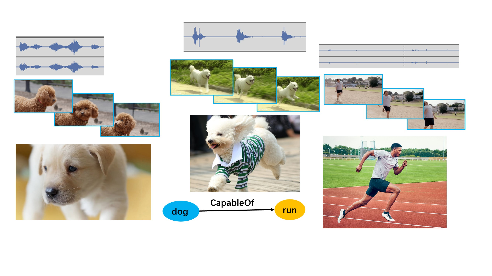
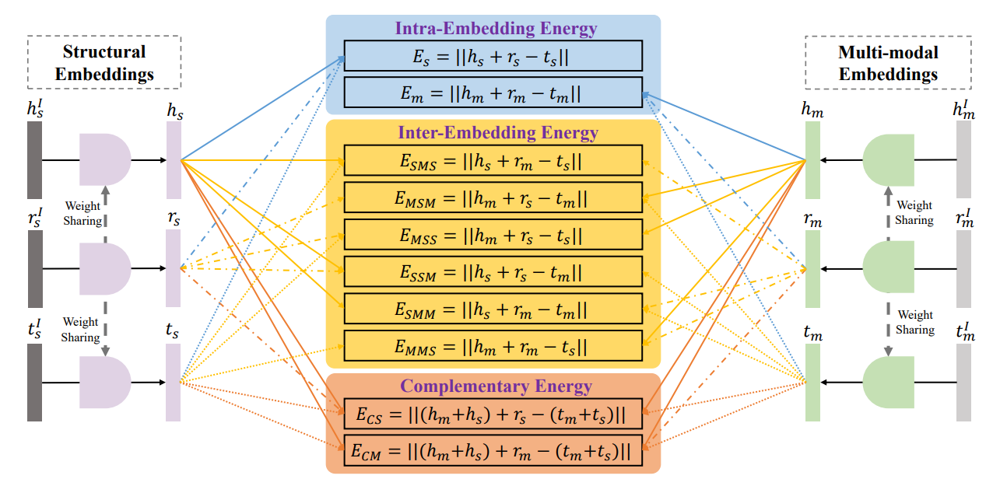
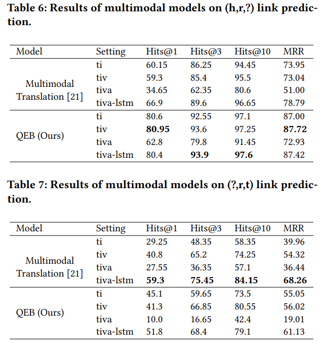

# TIVA-KG: A Multimodal Knowledge Graph with Text, Image, Video and Audio

## Knowledge Graph
TIVA-KG is a brand new multimodal knowledge graph equipped with **multiple modalities** and **triplet grounding**, granting it superior expressing ability.  

  

If you are interested in TIVA-KG itself, please check out our website at http://mn.cs.tsinghua.edu.cn/tivakg. This repo is instead focused on the Quadruple Embedding Baseline (QEB) model to exploit the knowledge in TIVA-KG.

## Method

QEB is a simple translational model as indicated by its name, yet it has the ability to exploit the novel features of TIVA-KG.  

As a translational model, QEB follows the basic rule: $h + r \approx t$. By implementing this rule with various combinations of structural and multimodal embeddings, we get some energy functions.  

  

Putting them together, we can get the final training objective.

$$
\begin{align}
E(h, r, t) &= E_s + E_m  + E_{CS} + E_{CM} + E_{MSM} + E_{SMS} \nonumber \\
           &+ E_{MSS} + E_{SSM} + E_{SMM},+E_{MMS}.
\end{align}
$$

$$
\begin{align}
L_{\textsf{head}} = \sum\nolimits_{(h,r,t)\in T} \sum\nolimits_{(h,r,t')\in T_{\textsf{tail}}'} max(\gamma + E(h,r,t) - E(h,r,t'), 0),
\end{align}
$$  

$$
\begin{align}
L_{\textsf{tail}} = \sum\nolimits_{(h,r,t)\in T} \sum\nolimits_{(h',r,t)\in T_{\textsf{head}}'} max(\gamma + E(t,-r,h) - E(t,-r,h'), 0),
\end{align}
$$  

These are the results from our experiments:  
  

## Usage
Prepare the environment with:  
```bash
conda create -n tiva-kg python=2.7 tensorflow-gpu=1.14
conda activate tiva-kg
```

Prepare data by downloading from https://mailtsinghuaeducn-my.sharepoint.com/:f:/g/personal/autogl_mail_tsinghua_edu_cn/EudDw-AAwVlFnndC6swJKtQBLiFIFpWIB9kmbt_Gnh6DQw?e=bvsiDC. You will notice an experiment.tar.gz which contains experiment related files, but running the code also requires to have downloaded mmkg_data.tar.gz.
Then modify parameters.py and test_parameters.py to fit where you put these files.  

UPDATE: We notice the old all.txt seems to be corrupted. We have uploaded a fixed one in github release. You can also simply concatenate the content (mind the empty lines at the end of these files) of test.txt, valid.txt, and train.txt to get the fixed one.  
The subset of multimodal embeddings for running experiments has now been uploaded onto OneDrive. Find the exp_mm.hdf5 in the link above.  

Modify parameters.py and test_parameters.py to get your desired settings. Use model_id to identify different settings.  

To run the experiment, simply:
```bash
python train.py
python test.py
```

## Citation
```text
@article{wang2023tiva,
  title={TIVA-KG: A Multimodal Knowledge Graph with Text, Image, Video and Audio},
  author={Wang, Xin and Meng, Benyuan and Chen, Hong and Meng, Yuan and Lv, Ke and Zhu, Wenwu},
  year={2023}
}
```
